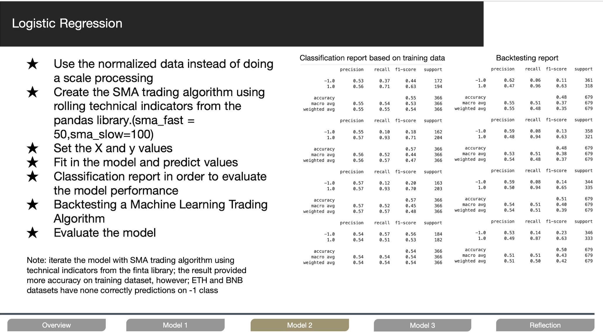

Our Project Layout:

- We want to Create a trading bot for cryptocurrency with different strategies. Each strategy will correspond to a different machine-learning algorithm. We will then compare the performance of these models to our creation of an inefficient frontier of different portfolios of cryptos we are using. 


- Models we will use:

1. SVM
2. LogisticRegression 
3. RandomForestRegressor(New Machine Learning Model)

- We will use the following cryptocurrency:

“”
1. Eth
2. BTC
3. BNB
4. XRP

“”

- DataSources

1. Binance API for historical and live crypto data 
2. We will also use Yahoo Finance to collate data if required, 

Modules

—- Undecided Module for a new machine learning algorithm 

**Our Findings
**
Our Overall Strategy
- We had a three phrase approach to conducting our analysis
  1. Conduct data collection using yfinance API, and then clean/wrangle this data before use
  2. Utilise machine learning models on various technical indicators
  3. Compare model metrics to identify most appropriate model
 
What Data We Used
- Used 3 year historical closing price data for the following cryptocurrencies
  1. Bitcoin
  2. Ethereum
  3. XRP
  4. BNB

- SVM Model had limited accuracy and was very random in the results derived
  

- Similar to SVM, the Logistic Regression was not very accurate
  

- Similar to SVM, the Logistic Regression was not very accurate

The Random Forests Regression was much more accurate. We looked at percentage increases as signal, with close price data as an input which we fit to a regression random forest. This seemed to be overfit to the data, but might've been due to it predicting such small movements in data which had a linearly increasing-trend. 

The final ML algorithm we fit was the Random Forests classifier to the data. We used shorter moving averages (5 days and 20) on the data given the volatile nature of the stocks and the fact that longer moving averages weren't fit as well prior. The signal was derived from when the shorter moving average moved above the long moving average. The Random forest was trained on the moving average data with the corresponding trading signal. This ML algorith appeared to work the best with high precision values and reasonable outputs when applied to the test data. 

We would like to expand this Random forests analysis to include more explanatory variables and test out real time trading strategies with a wallet, a buy/sell amount and a mult-crypto portfolio

